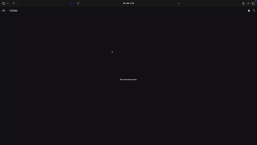

# OpenNote



A notebook app that you can host on your local machine for daily use. It is built with Rust and supports semantic search natively, making knowledge management much more efficient. 

The project is still new. Please feel free to raise issues or contribute. 

Reach me out at https://discord.gg/MXnzmRcDFh

## Features

- Support multi-user access. Each user can have their own private workspace. 
- Support semantic search. 
- Support importing webpages and also search them semantically. Great for researchers, students and anyone who needs to read documents. 
- Built with `actix-web` and async tech stacks. Blazingly fast!
- More features are yet to come. Stay tuned!

## Get Started

### Prerequisites

This project relies on `Docker` to run itself as a web service. It relies on `Qdrant` as a vector database. Finally, it needs an embedding service to make vectorizations, which can be `vLLM` or any OpenAI-Compatible API. 

- [ ] Have `Docker` installed. 
- [ ] Have a `Qdrant` instance hosted locally. 
- [ ] Have access to OpenAI-Compatible embedding service. 

### Install Docker

`Docker` isolates the service from the rest of your computer/server. Even if the service itself messes things up, you will still keep your computer/server clean. 

This is why we chose to use `Docker` to ship this project. 

You may refer to Docker's official tutorial for installation: https://docs.docker.com/get-started/get-docker/

### Install Qdrant

`Qdrant` is required for OpenNote to process the notes you put in. `Qdrant` also requires `Docker` to setup. Usually, if you are on a Linux machine, you may use the following command to boot it up:

```sh
docker run -p 6333:6333 -p 6334:6334 \
    -v "$(pwd)/qdrant_storage:/qdrant/storage:z" \
    qdrant/qdrant
```

This will start `Qdrant` in the `Docker` you have just installed and create a data folder where you started the service. For example, if you are at `/home/some_user`, the data folder will be at `/home/some_user/qdrant_storage`. So please choose a desired location to put your data. 

For detailed instructions on setting `Qdrant` up, please check out their official document: https://qdrant.tech/documentation/quickstart/

### Get an Embedding service API

Any provider who provides OpenAI-Compatible embedding API services works with this project. You may also just use OpenAI's endpoints too. 

You may also host a `vLLM` instance locally, which is totally free. Below is a script that I use to run a `vLLM` instance. Notice that it will still need to make use of `Docker`:

```sh
#! /bin/sh

echo "Removing existing vLLM container..."
docker rm -f vllm

echo "Starting vLLM container..."

docker run -d --runtime nvidia --gpus all \
    -v ~/.cache/huggingface:/root/.cache/huggingface \
    --name vllm \
    --env "HUGGING_FACE_HUB_TOKEN=<Your huggingface token>" \ # this may not be required
    --env "HF_ENDPOINT=https://hf-mirror.com" \ # use this, if you are in Mainland China
    -p 8000:8000 \
    --ipc=host \
    vllm/vllm-openai:latest \
    --api-key <setup an api key> \ 
    --model sentence-transformers/all-MiniLM-L6-v2 \
    --dtype=half \
    --gpu-memory-utilization=0.99 # adjust according to your needs
```

You may also refer to their official document for more in-depth setup tutorial: https://docs.vllm.ai/en/latest/deployment/docker/

### Configure the project

In `backend/config.prod.json` (create one and copy and paste the json below if you don't see it):

```json
{
  "logging": {
    "format": "json",
    "level": "info"
  },
  "server": {
    "host": "0.0.0.0",
    "port": 8080,
    "workers": 4
  },
  "user_information_storage": {
    "path": "./data/user_information_storage.json"
  },
  "metadata_storage": {
    "path": "./data/metadata_storage.json"
  },
  "database": { // Configure Qdrant
    "index": "notes", // You may just leave it, or put a cooler name here
    "base_url": "http://192.168.0.116:6336", // The gRPC API endpoint of your Qdrant instance
    "api_key": "meilimasterkey" // Ignore this. We haven't yet supported API key. 
  },
  "embedder": { // Configure embedding service
    "base_url": "http://192.168.0.101:8000/v1/embeddings", // The embedding service's API endpoint. 
    "model": "sentence-transformers/all-MiniLM-L6-v2", // The model you want to use. If you are using it from a service provider, like OpenAI, you may refer to their official documents on which models are available. 
    "vectorization_batch_size": 100, // Increase this number if your OpenNote is too slow.
    "encoding_format": "float", // Leave it as float
    "dimensions": 384, // Refer to your service provider's document for your model's dimensionality. 
    "api_key": "" // API key
  }
}
```

### Setting up the project

The project comes with a `build_and_deploy.sh` script at the root. You need Docker installed to get it deploying the notebook for you. 

If you would like to specify a different place to store data. You may change the following:
```sh
DATA_DIR="/data/notes"
```
to wherever you want. 

## Contribute / Raising issues

Any issue being raised is a push to me to make the project more usable for you and other users. It is more than welcome to raise an issue in the `issue` tab of this project. 

Any contribution is welcomed. 

## Development

If you would like to add more features or fix bugs for this project, you may need to first be able to compile and test it locally. 

To compile and run the Rust backend is rather simple. The Rust backend is located at `./backend`. Just navigate to the directory and run `cargo run` there. 

For the Dart frontend, the project uses `fvm` to manage the Flutter SDK and Dart. You may need to have `fvm` installed first. Then, just navigate to `./frontend` and run `fvm flutter run -d chrome` to compile and run. 

## License

This project is released under MIT. The purpose of this project is to explore the possibility of semantic search, AI, and Rust in the notebook use case. 